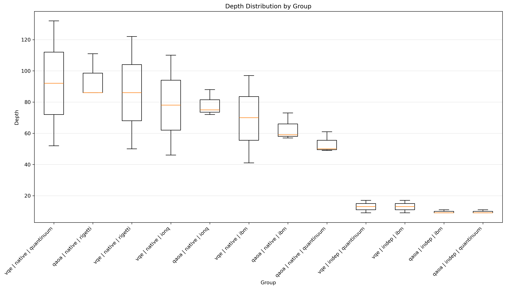
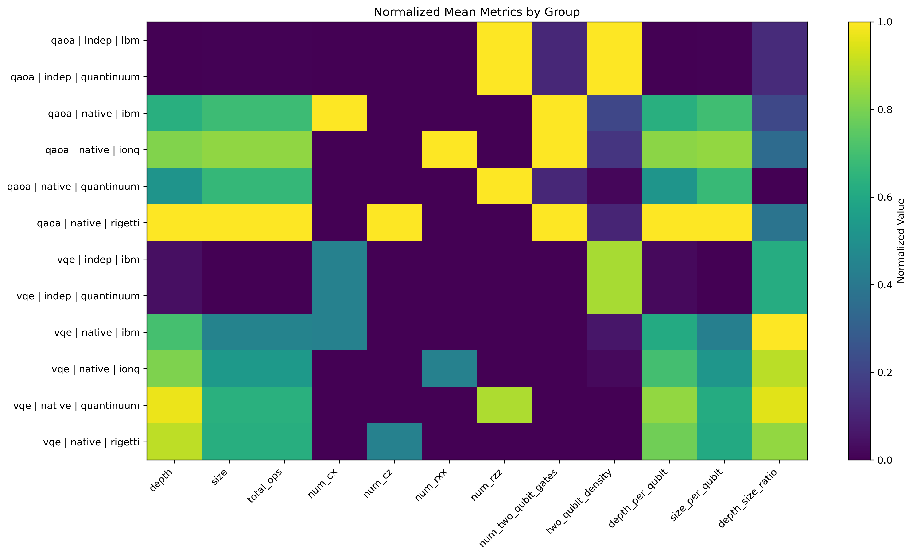
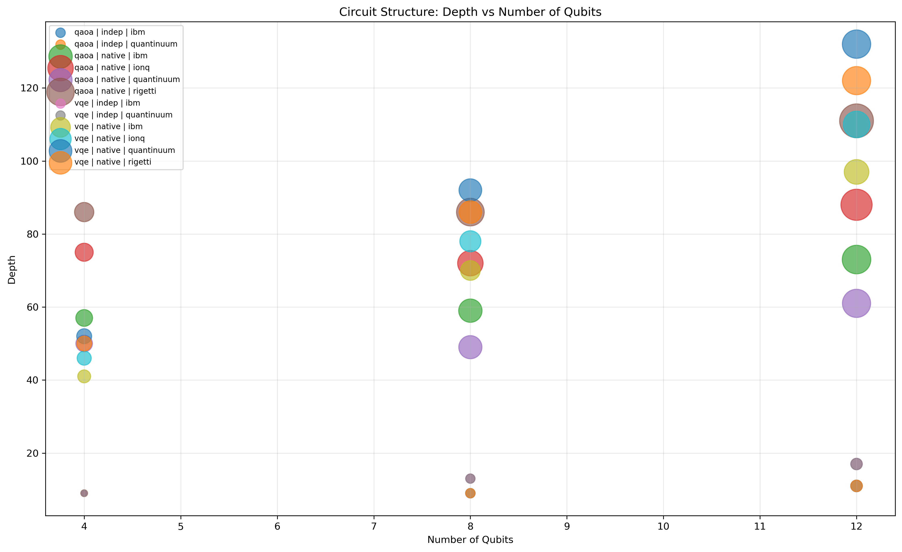
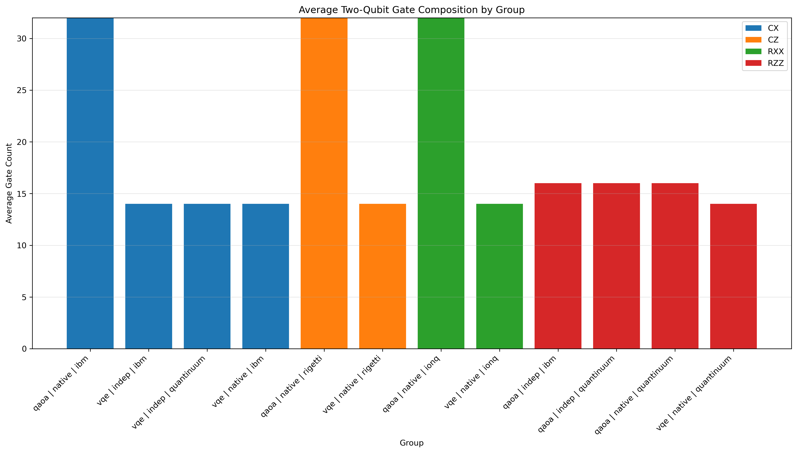
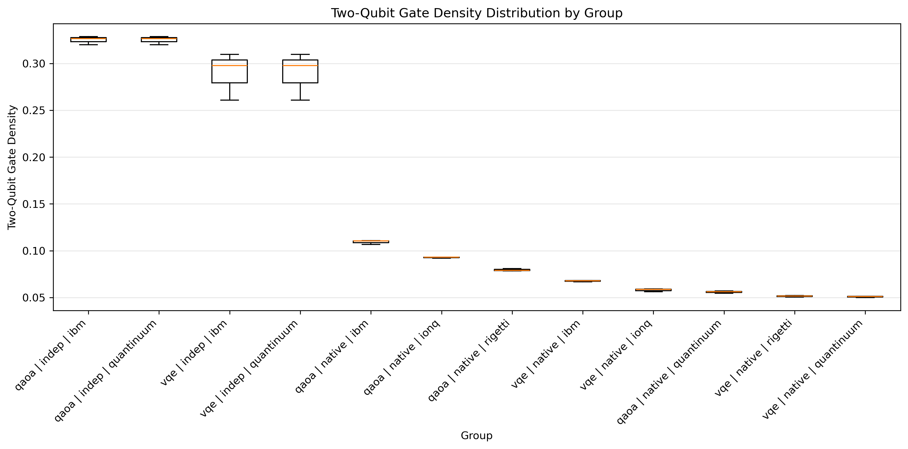
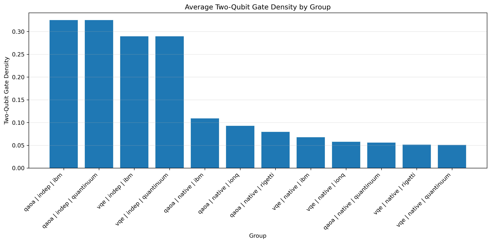
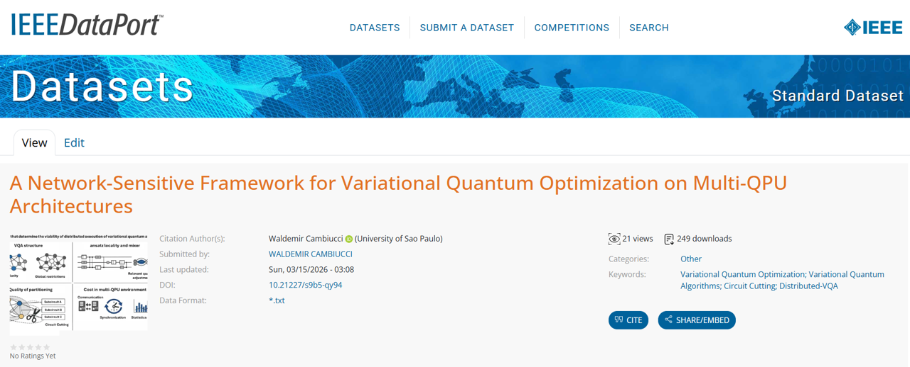

# DVS - Distributed Viability Score

Variational Quantum Algorithms (VQAs) are widely seen as one of the most practical methods for near-term quantum computing, but their scalability remains limited by qubit availability, noise, transpilation overhead, and sampling cost. Distributed quantum computing and circuit cutting aim to extend execution across multi-QPU architectures and quantum networks. However, distribution is not inherently advantageous, as it depends on problem structure, ansatz and mixer locality, partitioning strategy, and communication overhead. This paper proposes a network-sensitive framework for Distributed VQAs (D-VQAs) that combines hypergraph partitioning, ansatz-aware and mixer-aware strategies, and a cost perspective including local execution, communication, synchronization, sampling, and reconstruction. The framework identifies viability regimes in which distribution may provide architectural advantage or be dominated by network overhead.

As a first step in the analysis, we consolidated the many dimesions from benchmark circuits, comparing the qubit connectivity, size, width, density, to visualize the behaivor and first impressions about different structures of QAOQ and VQE algorithms. Two first scripts to run those tasks are presented:

Script: dvs 01 - reading benchmark circuits for dimensions: [Scripts documentation](./dvs 01 - reading benchmark circuits for dimensions.ipynb)
Script: dvs 02 - drawing dimensions from benchmark circuits: [Scripts documentation](./dvs 02 - drawing dimensions from benchmark circuits.ipynb)

From where we created several insights:

  
   
  <strong>Boxplot Depth by Group</strong>

                                                            

  
   
  <strong>Heatmap Group Metrics</strong>

  
   
  <strong>Scatter Depth vs qubits</strong>

  
   
  <strong>Stacked two qubit gates by group</strong>

  

  
   
  <strong>Two_qubit_Density_Boxplot</strong>

        

  
   
  <strong>Two qubit Density by Group</strong>

The complete dataset with all benchmark quantum curcuits used for this research is published at IEEE DATAPORT, as follows:

  
   
  <strong>dataset at IEEE DataPort</strong>

Waldemir Cambiucci, "A Network-Sensitive Framework for Variational Quantum Optimization on Multi-QPU Architectures", IEEE Dataport, March 15, 2026, doi:10.21227/s9b5-qy94
https://ieee-dataport.org/documents/network-sensitive-framework-variational-quantum-optimization-multi-qpu-architectures
